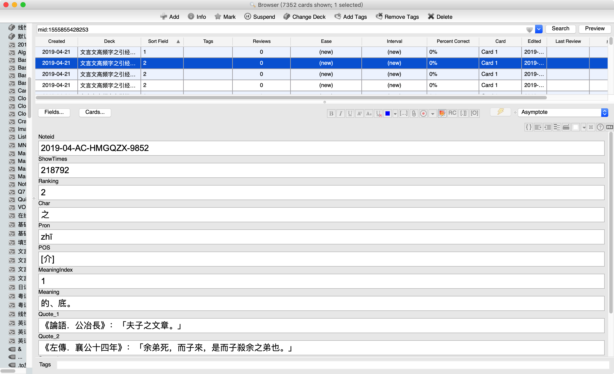
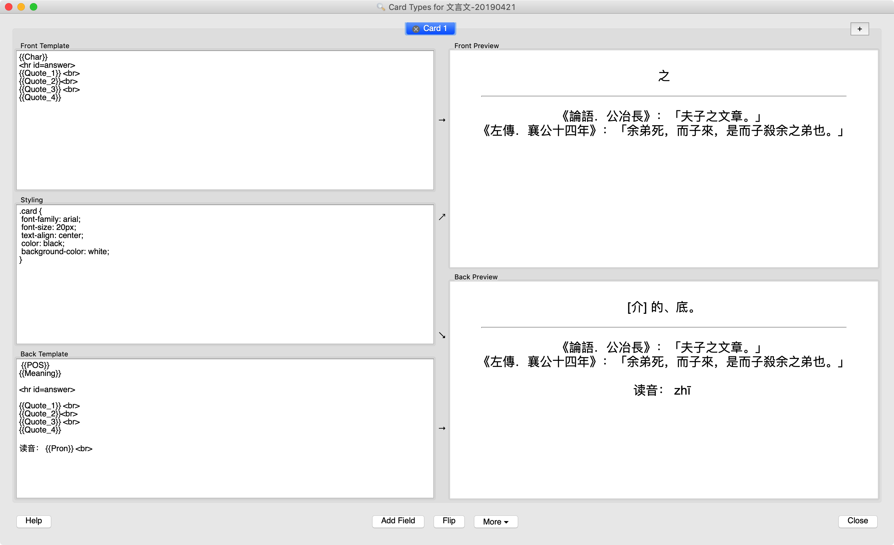

参照 [古代汉语字頻序表](http://corpus.zhonghuayuwen.org/resources.aspx)，若某字在国语辞典的释义中含有经典引用，则提取所需相关信息导出 csv，并制成 Anki 卡组。

## 用途
经典古籍的“语境” + 语料分析的高频字信息 = 高效学习常用的古文字词

### 我的经历
以前是读类似《文言读本》的书籍，每读一页摘一个词，然后上汉典查询更详尽的释义和引用例句来制作卡片。这种方法的优点是来源是自己感兴趣的文本，目标导向，词语只是顺带学习，缺点就是顺带学习的制卡步骤是重复的，有些浪费时间。
而批量制卡的优缺点正好相反，减少重复性劳动，但可能文本内容更多时候是为“记单词”而服务。
另外，国语辞典中的引用虽每处只是一句话，但由于文言的简洁性，联系出处的上下文已足够能体会到某个字词特定含义的“使用语境”了。

## apkg 卡片内容

每张卡片含有以下内容：

* `Id`: 为解决 Anki 首字段不得重复的问题而设

* `Ranking`: 字的频序，排名越前说明越常用。如``字，此值为`1`

* `ShowTimes`: 字在语料库中的出现字数

* `Characters`: 字

* `Meaing`: 释义

* `Quote`: 典籍或诗文的引用片段，一般会有两处；极少数`字`会有四处

### 截图

## 下载
* [apkg](https://github.com/hmgqzx/Practical_Pet_Projects/tree/master/Scraper/%E6%96%87%E8%A8%80%E6%96%87%E9%AB%98%E9%A2%91%E5%AD%97%E5%BA%93/apkg)

* [out.csv](https://github.com/hmgqzx/Practical_Pet_Projects/tree/master/Scraper/%E6%96%87%E8%A8%80%E6%96%87%E9%AB%98%E9%A2%91%E5%AD%97%E5%BA%93/data)

## 资料版权声明
[Click Here!](https://github.com/hmgqzx/Practical_Pet_Projects/tree/master/Scraper/%E6%96%87%E8%A8%80%E6%96%87%E9%AB%98%E9%A2%91%E5%AD%97%E5%BA%93/data)
